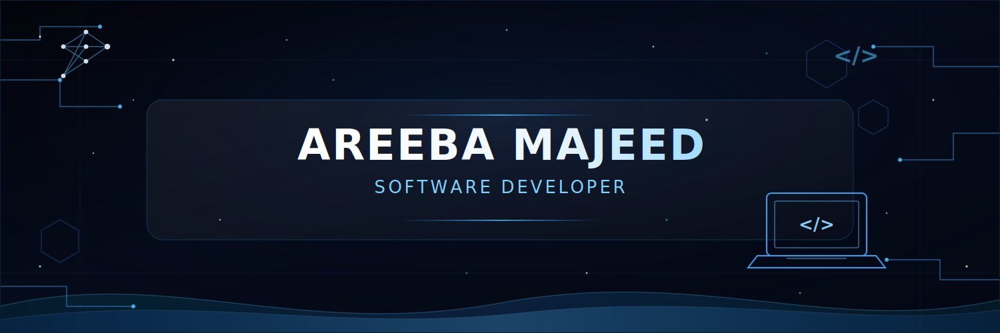

 

 

<h2 align="center">✦ WHO AM I ✦</h2>

### Areeba Majeed

- 🧠 AI Engineer & Full Stack Developer crafting intelligent systems that bridge the gap between raw data and real-world impact.
- 📍 Location → Pakistan
- 🎓 Education → BS Computer Science
- 🌐 Portfolio → [areebamajeed.me](https://areebamajeed.me)
- ⚡ Specialty → MERN · Machine Learning · Deep Learning
- 🚀 Mission → Ship AI that creates real value

> "I don't just build models — I engineer systems that think, adapt, and scale."

## 🛠️ Tech Stack

 

**Languages**

  

**Frontend**

  

**Backend & Database**

  

**Tools**

 

<h2 align="center">🐍 CONTRIBUTION SNAKE</h2>

  

## 💼 Featured Projects

 

<table>
<tr>
<td width="50%" valign="top">
<h3>💼 HrConnect</h3>

<i>Full-stack MERN job portal — recruiters post openings, candidates search & apply, all managed from one dashboard.</i>

  

</td>
<td width="50%" valign="top">
<h3>📝 FormFlow</h3>

<i>Google Forms–style builder in Next.js — create, publish & manage custom forms with file uploads and response analytics.</i>

  

</td>
</tr>

<tr>
<td width="50%" valign="top">
<h3>⚽ Football Live Scoreboard</h3>

<i>Real-time scoreboard streaming live fixtures, scores & standings via the API-Football service.</i>

  

</td>
<td width="50%" valign="top">
<h3>🌟 More Projects</h3>

<i>Additional MERN and Next.js builds, experiments, and coursework — all on my GitHub profile.</i>

  

</td>
</tr>
</table>

 

<h2 align="center">📊 GitHub Stats</h2>

<h2 align="center">🏆 ACHIEVEMENTS</h2>

  

<h2 align="center">📫 Let’s Connect</h2>

I'm always open to discussing new opportunities, collaborations, and interesting problems to solve.

  

⭐ from <a href="https://github.com/areeba-majeed">Areeba Majeed</a>

